# Connecting to the virtual PLC

**IMPORTANT**

When you want to connect to a PLC, physical or virtual, you must have started your project _containing_ your PLC project. You should have in your solution explorer the _entire_ project like so:

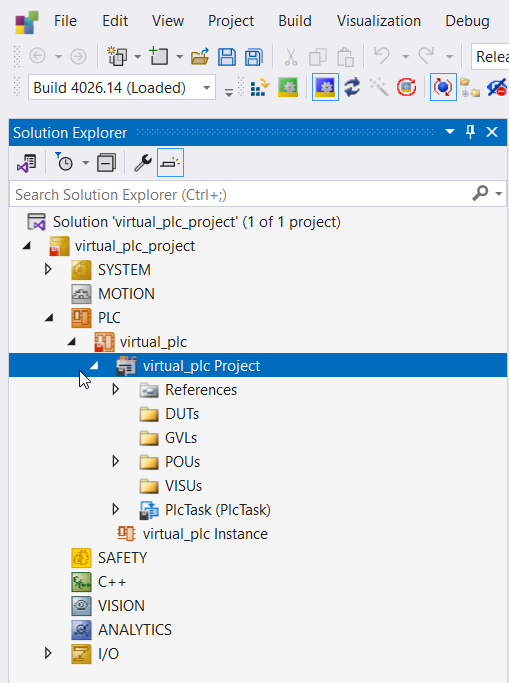

**IMPORTANT**

When you want to connect to a PLC, physical or virtual, the PLC must be available on your network. This means that you _know where to search_ for the plc. In this tutorial we'll connect to the virtual PLC that should be running inside a VirtualBox VM. You can tell if that is the case if you can see the VM instance being started like so:

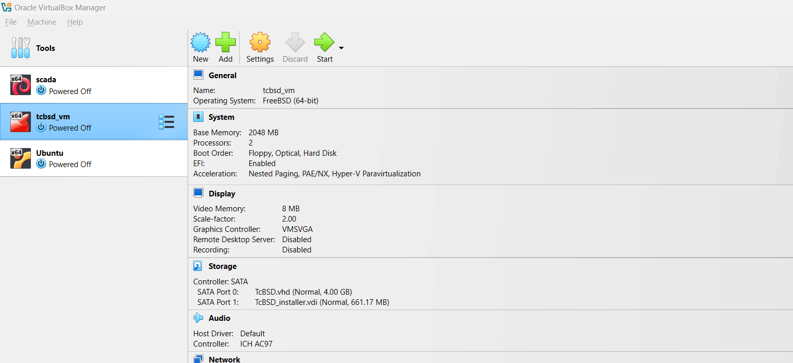

1. First, you must tell TC3 where a compiled program must be uploaded to. You do that by telling wat your `target system is`.
   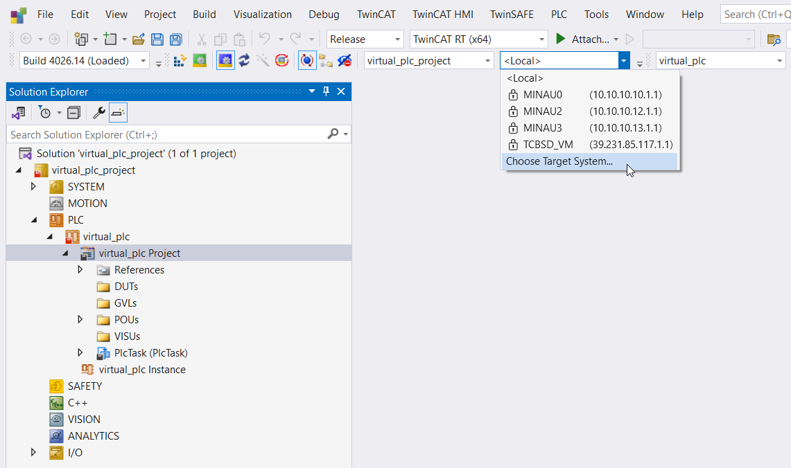

2. Do a search for your target
   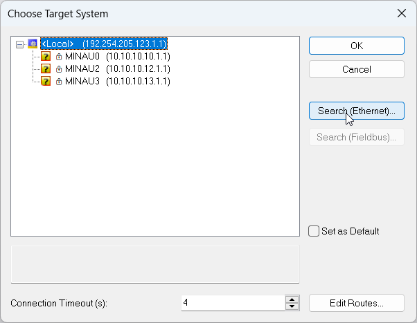

3. Do a broadcast search
   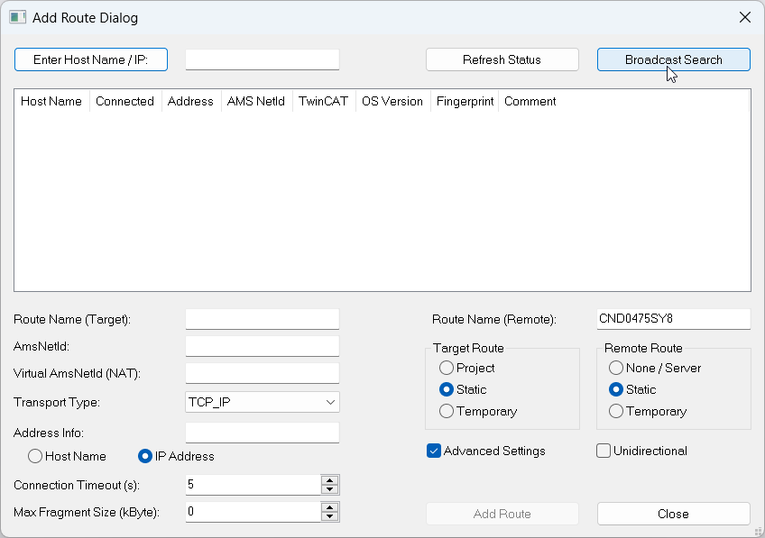

4. Choose the network you want to search. Our virtual PLC is running inside the VirtualBox host network, so we neet to connect to the VirtualBox application via the (virtual) network adapter.
   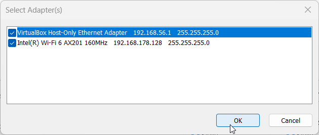

5. If all is well (and I hope for you that it is so, otherwise you have missed a critical step somewhere up to here) then your virtual PLC has been found.
   - Make sure you have ticked the option `IP Adress` beneath `Adress info`
   - Now add a route to this PLC by pressing `Add Route`
   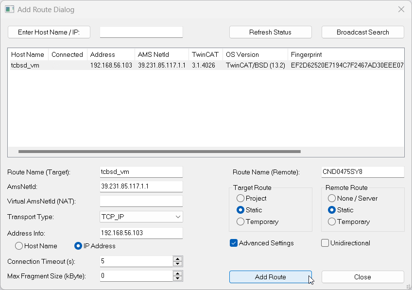

6. In the route dialog box
   - Tick `Secure ADS`
   - In the `Remote user credentials` section
     - Provide "Administrator" as `User`
     - Add "1" as the standard Password for `Password`
   - Press `OK`
     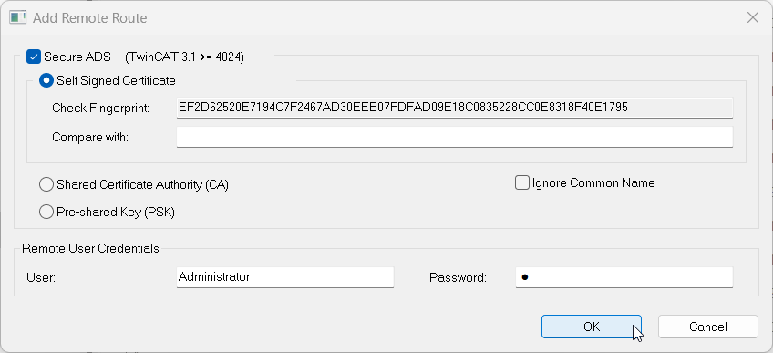

7. You are now connected to the target. Notice the lock in the column `connected`
   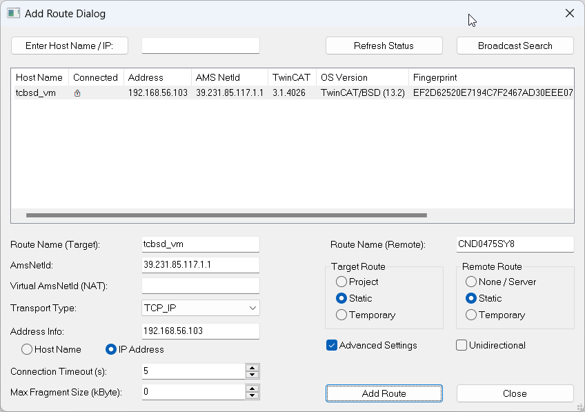

8. After pressing `Close` you now return to the dialog for choosing your target. Notice the `connected` gear icon!
   

9. Double click on the target of the previous step and acknowledge switching to another solution platform.

    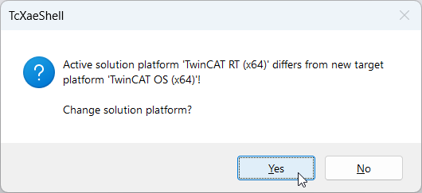

10. You should now see the hostname of your virtual PLC you are connected to. Notice the lock before the hostname!
    
    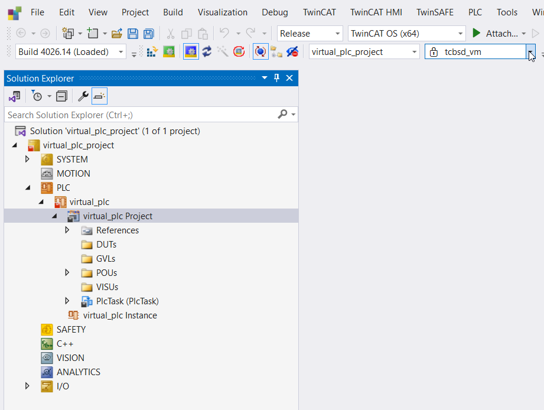