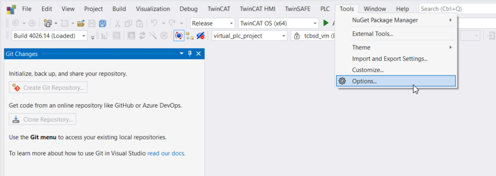
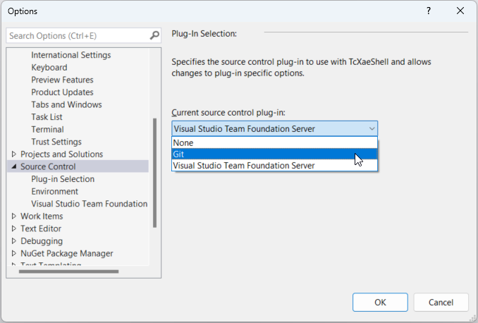
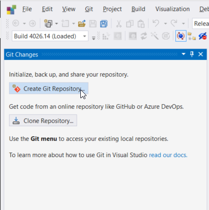
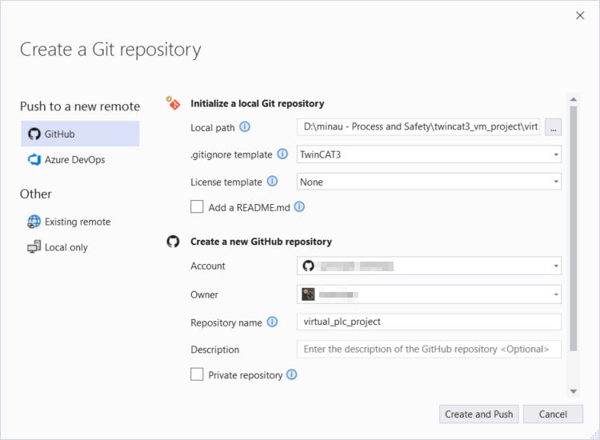

# Set up GIT version control

It is wise to enable GIT version control because the source control is not standard set up to use GIT!
1. Go to Tools -> Options in the main menu
   
2. Go to source control and choose GIT
   
3. See that you now can create a new repository.
   
4. Create a repo locally, and remotely on Gitub, and push this to the remote
   