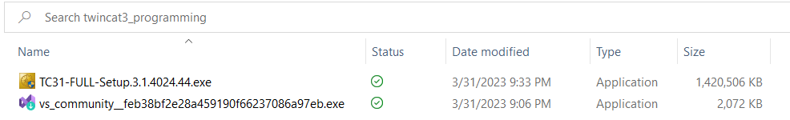

# Using TwinCAT3 and a virtual PLC instance

This manual gives instruction on installing software so you can use the TwinCAT 3 (from now on called `TC3`) software together with a PLC instance on a virtual machine.

Running a PLC in a virtual machine will let you program a PLC (although without physical inputs and outputs) as you would on real hardware.

Apart from the installation and setup of TC3, Virtualbox and the Virtual PLC image there are also instructions on the use of TC3 with starting a new project, as well as connecting to the virtual PLC.

This manual shows you the installation of files that you should already have downloaded. The downloaded files provided via the SURF download link on Brigtspace will show you:

Please make sure you have correctly downloaded these files!