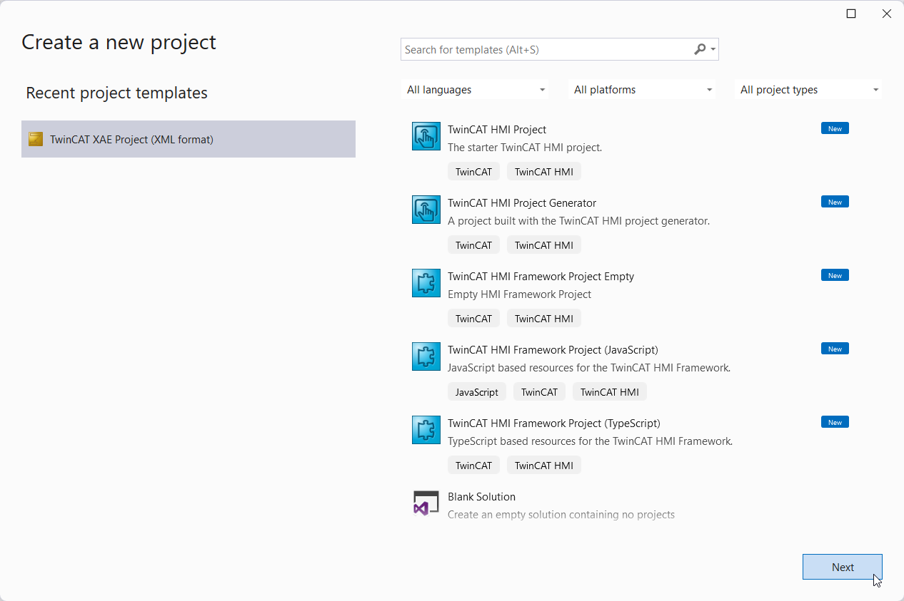
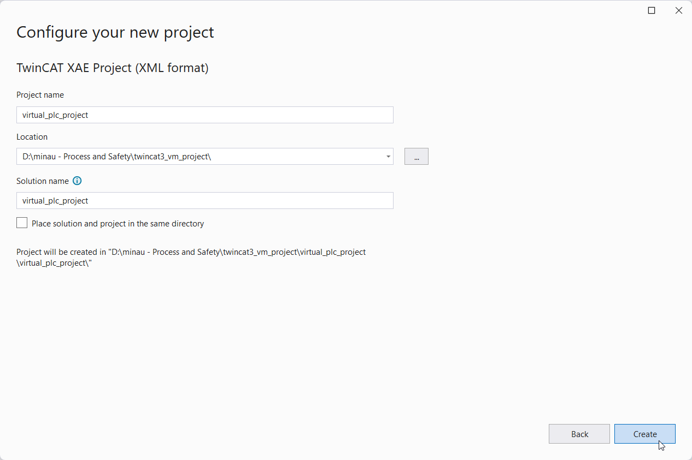
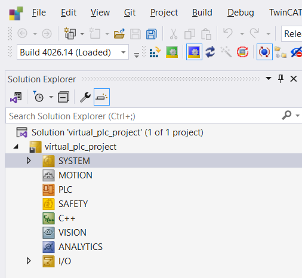
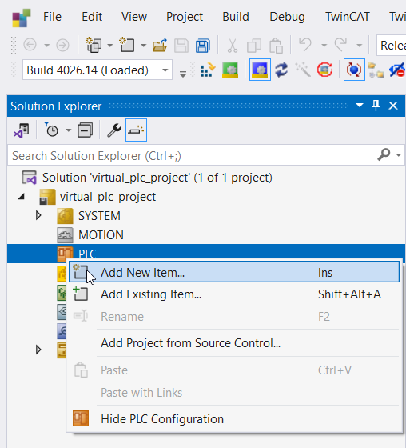
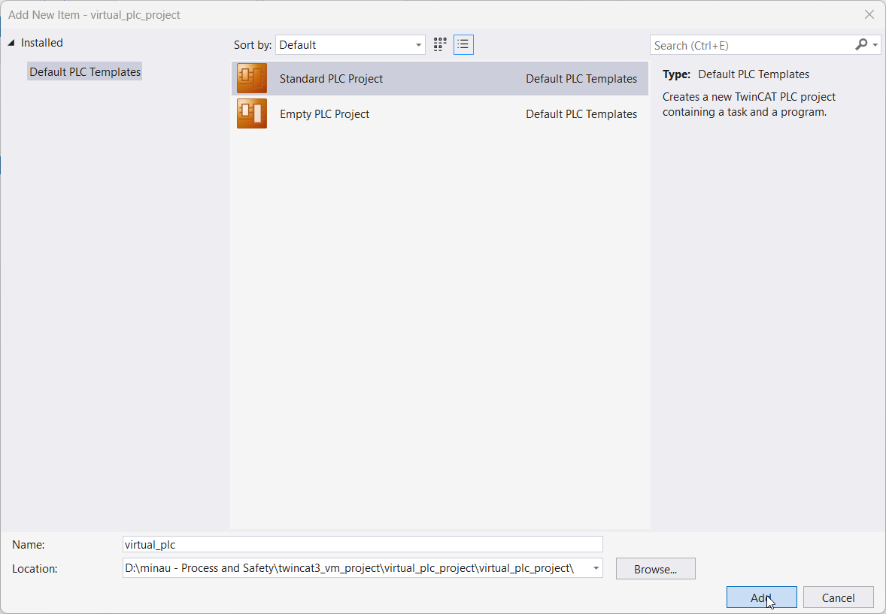

# Creating a new project

1. Open TwinCAT XAE shell
2. Create a new project
   
3. Provide a location and name
   
4. You have now created an empty project. Your solution explorer should look like so:
   
5. Since you have now an empty project, you must tell TC3 that you have a PLC as part of your project. Right mouse click on `PLC` in te tree, and `add a new item`
   
6. Add a new `standard PLC project` to the project, in this case it will be the Virtual PLC that we're going to program.
   
7. Expand the PLC item in the solution explorer. You should now be able to add files to your PLC project in te same manner as you would with CODESYS. Your trees should look like so:
   