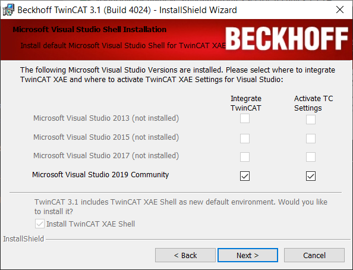

# Do not integrate into MSVC 20xx

Make sure to install `TwinCAT XAE Shell`. If you know wat you are doing you can integrate TwinCAT in a Microsoft Visual Studio installation so you'll have pretty much the same user experience.