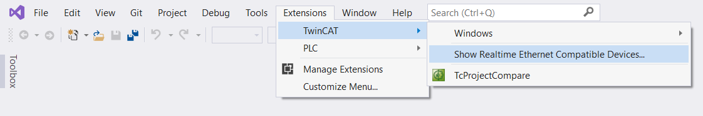
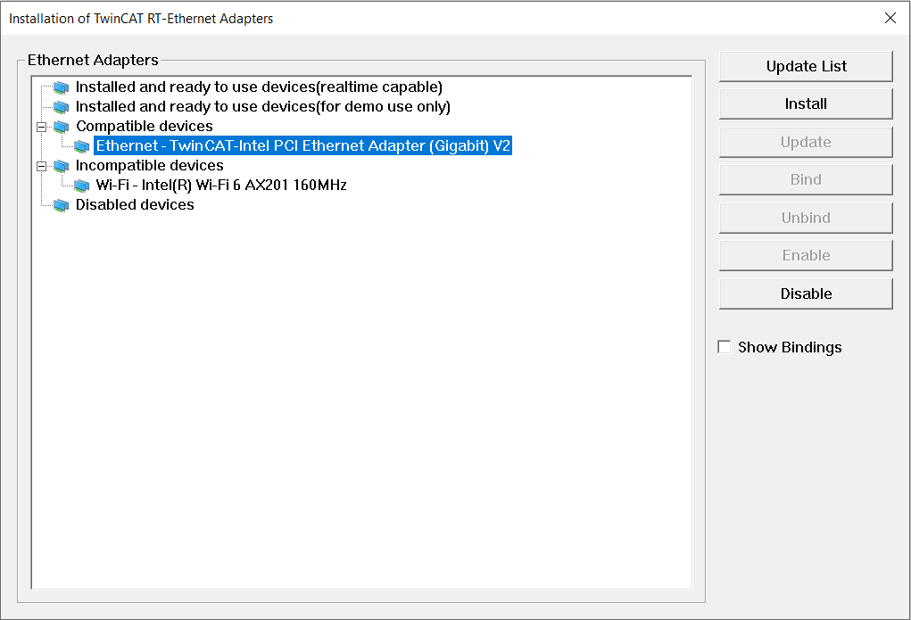

# Step 6, optional for Realtime usage

When you plan to use your PC/Laptop as a PLC (Beckhoff PLC's are PC's with realtime capability) you must have an Ethernet controller with a Realtime  drivers. Beckhoff only supports "a few" Intel Ethernet cards.

For a full list of realtime supported ethernet controllers see [this link on the Beckhoff Infosys page](https://infosys.beckhoff.com/english.php?content=../content/1033/tc3_overview/9309844363.html&id=)

So if you are in need of a test setup, or in an educational environment where there are no production requirements for example and don't mind entering the trial license on a weekly basis, you can build your own TwinCAT 3 realtime capable PC/Laptop if you have the proper intel network controller. Get a (basically any) PC, and for a few tens of euro's you can buy used/refurbished network cards. Put them in an empty slot, and you're ready to go.

I found installing the Realtime driver is easies done thru MSVC 2019. Since integration is done, you should see a menu `Extensions` in which you find `TwinCAT` and that menu has an item called `Show Realtime Ethernet Compatible Devices...`

When you have devices that are capable, you can select the device(s) and install the proper driver. After that, you can detect and use EtherCAT hardware connected to the NIC you have installed the Realtime Driver for. Below you can see my wired network connection on my Laptop is capable of driving the EtherCAT bus, and my WiFi isn't.

