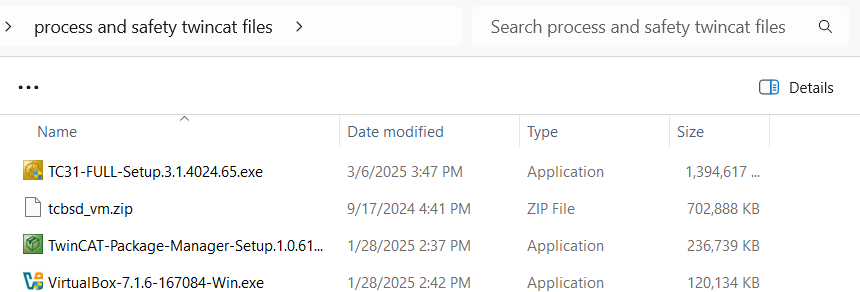

# Twincat 3 installation

This section will show you how to install TwinCAT 3 XAE so you can create programs for computers capable of controlling the EtherCAT bus.

Te downloaded files provided via the SURF download link on Brigtspace will show you:

Please follow the screenshots to install TwinCAT XAE Shell when you start the installation via `TC31-FULL-Setup.3.1.40xx.xx.exe`.
