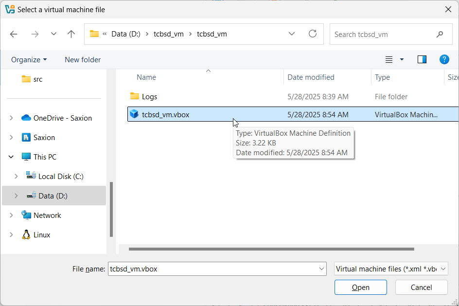
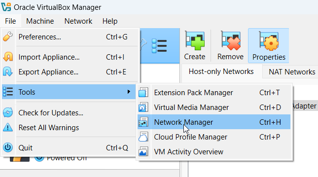
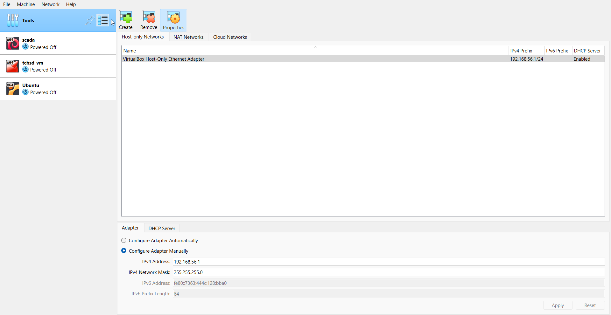
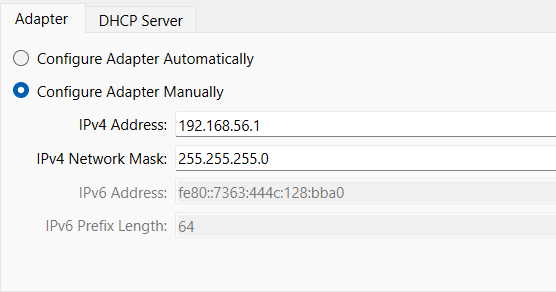
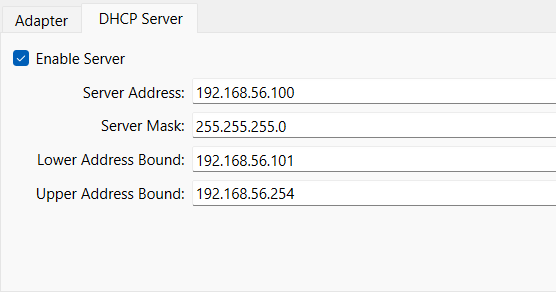

# TwinCAT virtual PLC

1. Install Oracle Virtualbox
2. Unzip `tcbsd_vm.zip`
3. Open Virtualbox
4. Add the virtual machine you have unzipped in step 2 to virtualbox
   1. by pressing the big green `PLUS`
   2. and navigating to the file inside the recently unzipped directory
   3. Select the virtual machine file.
      
   4. open the virtualbox network manager
      
   5. Select the virtualbox host only ethernet adapter.
      
   6. Set the adapter manual settings
      
   7. Set the adapter DHCP settings
      
    